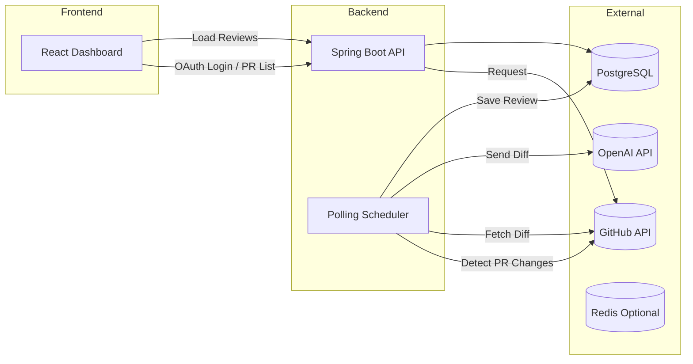

<p align="center">     </p>

<br>

# 🤖 AI Collab
**LLM 기반 GitHub Pull Request 자동 코드 리뷰 플랫폼**


---

## ⭐ 프로젝트 소개

AI Collab은 GitHub Pull Request 기반으로 동작하는
자동 AI 코드 리뷰 생성 플랫폼입니다.

OpenAI API를 이용해 PR diff를 분석하고
코드 개선 포인트, 리팩터링 제안, 스타일 검증 등을 자동화하여
팀원의 리뷰 부담을 줄이고 협업 효율을 높이는 데 목적이 있습니다.

---

## 🧩 주요 기능
| 기능                      | 설명                                    |
| ----------------------- | ------------------------------------- |
| 🧠 **AI 자동 리뷰 생성**      | Pull Request의 diff를 기반으로 GPT 리뷰 생성    |
| 🔍 **PR 변화 자동 감지**      | Polling Scheduler가 새로운 커밋/PR 상태를 감지   |
| 📄 **리뷰 이력 저장**         | 커밋별 리뷰 기록을 PostgreSQL에 저장             |
| 🗂 **Repo & PR 조회**     | GitHub OAuth 기반 접근 가능한 Repo/PR 리스트 조회 |
| 🔐 **GitHub OAuth 로그인** | 안전한 인증/인가 제공                          |
| 📊 **대시보드 제공**          | React 기반 리뷰 뷰어 UI                     |


---

## ⚙️ Tech Stack

### 🖥️ Backend


### 💻 Frontend


### ☁️ Infra


---

## 🧱 시스템 아키텍처


---

## 📦 디렉토리 구조

```
ai-collab/
 ├─ backend/    # Spring Boot API 서버
 └─ frontend/   # React Dashboard
 ```
