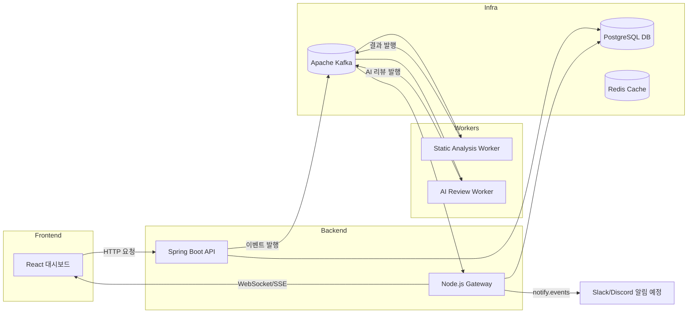

# 🤖 AI Collab
**LLM 기반 실시간 코드 분석·리뷰 및 협업 지원 플랫폼**

---

## 🧠 프로젝트 목표
“AI를 통한 효율적 코드 품질 관리와 협업 생산성 향상”

> 💡 **LLM(Language Model)** 은 ChatGPT와 같은 대규모 언어 모델로,  
> OpenAI API를 통해 코드 이해와 리뷰 피드백을 자동으로 생성합니다.  
> AI Collab은 LLM 응답을 Kafka 이벤트로 전달하여 실시간 협업을 지원합니다.

---

## 📌 프로젝트 개요
AI Collab은 팀 프로젝트에서 발생하는 **리뷰 병목, 반복 코멘트, 기준 불일치** 문제를 해결하기 위한  
**LLM 기반 실시간 코드 분석·협업 플랫폼**입니다.  
Kafka 이벤트 스트림을 통해 코드 리뷰, 메시지, 알림을 실시간으로 연결합니다.

---

## 🧩 주요 기능
| 구분 | 기능 설명 |
|------|------------|
| 🧠 **AI 리뷰** | 코드 변경 시 자동 분석 및 개선 제안 생성 (LLM 연동) |
| 🗂️ **프로젝트 관리** | 프로젝트 생성, 팀원 초대, 역할 관리 |
| 🧾 **리뷰 히스토리** | Kafka 이벤트 기반 코드 변경 내역 추적 |
| 💬 **실시간 협업** | Gateway 서버(WebSocket) 기반 메시지/알림 기능 |
| 📊 **대시보드** | 코드 품질 점수, 리뷰 진행 현황 시각화 |
| 🔐 **인증/인가** | JWT 기반 로그인 + Spring Security |
| ☁️ **파일 업로드** | AWS S3 연동 예정 (문서/코드 스냅샷 업로드) |

---

## ⚙️ Tech Stack

### 🖥️ Backend

### 💻 Frontend

### ☁️ Infra

---

## 🧱 아키텍처 설계

---

> 💬 *AI Collab은 “AI가 개발 협업을 보조하는 실시간 코드 리뷰 도구”를 목표로 합니다.*
