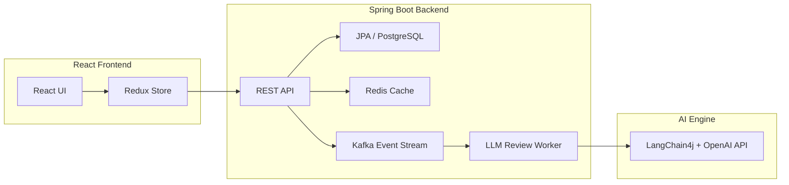

# 🤖 AI Collab
**LLM 기반 실시간 코드 분석·리뷰 및 협업 지원 플랫폼**

## 🧠 프로젝트 목표
> “AI를 통한 효율적 코드 품질 관리와 협업 생산성 향상”

---


## 📌 프로젝트 개요
AI Collab은 팀 프로젝트에서 발생하는 **리뷰 병목, 반복 코멘트, 기준 불일치** 문제를 해결하기 위해 만들어진  
**AI 기반 협업 플랫폼**입니다.  
LLM(Language Model)을 이용해 실시간으로 코드를 분석·요약하고,  
Kafka 기반 이벤트 스트림으로 코드 리뷰와 팀 커뮤니케이션을 연결합니다.

---

## ⚡️ 기술 스택

<p align="center">
  
  
  
  
  
  
  
  
</p>

---

## 🧩 주요 기능
| 구분 | 기능 설명 |
|------|------------|
| 🧠 **AI 리뷰** | 코드 변경 시 자동 분석 및 개선 제안 생성 (LLM 연동) |
| 🗂️ **프로젝트 관리** | 프로젝트 생성, 팀원 초대, 역할 관리 |
| 🧾 **리뷰 히스토리** | Kafka 이벤트 기반 코드 변경 내역 추적 |
| 💬 **실시간 협업** | Gateway 서버(WebSocket) 기반 메시지/알림 기능 |
| 📊 **대시보드** | 코드 품질 점수, 리뷰 진행 현황 시각화 |
| 🔐 **인증/인가** | JWT 기반 로그인 + Spring Security |
| ☁️ **파일 업로드** | AWS S3 연동 예정 (문서/코드 스냅샷 업로드) |

---

## ⚙️ 기술 스택

### 🖥️ **Backend**
| 분류 | 기술 |
|------|------|
| Language | Java 17 |
| Framework | Spring Boot 3.3.3 |
| ORM | Spring Data JPA |
| Database | PostgreSQL |
| Cache / Queue | Redis, Apache Kafka |
| AI / LLM | OpenAI API, LangChain4j |
| Auth | Spring Security + JWT |
| Docs | Springdoc OpenAPI (Swagger UI) |

### 💻 **Frontend**
| 분류 | 기술                       |
|------|--------------------------|
| Framework | React 18 (TypeScript)    |
| Styling | Styled-components / SCSS |
| State Management | Redux Toolkit            |
| Build | CRA (또는 Vite) 예정         |

### ☁️ **Infra**
| 구성 | 기술 |
|------|------|
| CI/CD | GitHub Actions |
| Hosting | AWS EC2, S3 |
| Repository | Monorepo (Backend + Frontend) |

---

## 🧱 시스템 구조도


---

## 🚀 실행 방법

### 📍 1. 백엔드 (Spring Boot)
```bash
cd backend
./gradlew bootRun
```
- 기본 포트: `8080`
- Swagger UI: [http://localhost:8081/swagger-ui/index.html](http://localhost:8080/swagger-ui/index.html)

### 📍 2. 프론트엔드 (React)
```bash
cd frontend
npm install
npm start
```
- 기본 포트: `3000`
- 개발 환경에서 백엔드와 프록시 연결 예정

---

> 💬 *AI Collab은 “AI가 개발 협업을 보조하는 실시간 코드 리뷰 도구”를 목표로 합니다.*
